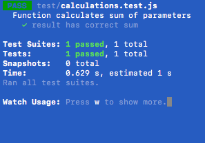
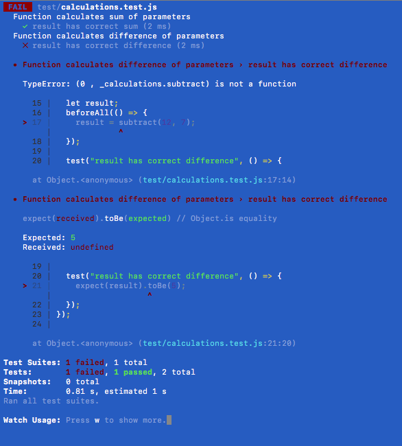
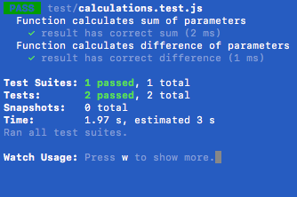

# Javascript Unit Testing with Jest

## What is Unit Testing?

as per [Wikipedia](https://en.wikipedia.org/wiki/Unit_testing):

> Unit tests are typically automated tests written and run by software developers to ensure that a section of an application (known as the "unit") meets its design and behaves as intended.

> In procedural programming, a unit could be an entire module, but it is more commonly an individual function or procedure. In object-oriented programming, a unit is often an entire interface, such as a class, but could be an individual method.

> By writing tests first for the smallest testable units, then the compound behaviors between those, one can build up comprehensive tests for complex applications.

## What is Jest?

In their own words:

> "Jest is a delightful JavaScript Testing Framework with a focus on simplicity."

Want more info? Go to the [Jest docs](https://jestjs.io/en/)

## Why

TWO WAYS TO USE THIS REPO:

- clone it, run npm install, run the tests - inspect the code and add more code to test

- DIY setup - full walkthrough of npm init and Jest install, customizing environment

### FAST TRACK - NO SETUP - CLONE THIS REPO - run npm install and go!

## DIY - Initial Setup

1. In your workspace directory, create a new project directory: `mkdir Testing-Exercises`
2. Navigate to your new project directory: `cd Testing-Exercises`
3. Initialize project directory to track npm packages: `npm init`

- package name: _( press enter or return )_
- version: _( press enter or return )_
- description: _( press enter or return )_
- entry point: _( press enter or return )_
- test command: `jest --verbose --watchAll`
- git repository: _( press enter or return )_
- keywords: _( press enter or return )_
- author: _( press enter or return )_
- license: (ISC) _( press enter or return )_

4. Install testing framework and dependencies: `npm install --save-dev jest babel-jest puppeteer @babel/core @babel/plugin-transform-modules-commonjs`
5. Launch VS Code from your project's root directory and add the following code to your `package.json` file (after main/before scripts):

```
"directories": {
    "test": "test"
},
```

6.  Create a `.babelrc` file in your project's root directory and paste the following code:

```
{
    "env": {
        "test": {
            "plugins": [
                "@babel/plugin-transform-modules-commonjs"
            ]
        }
    }
}
```

7. Initialize directory for version control: `git init`
8. Create `.gitignore` and add files/directories to ignore:
   `echo -e ".DS_Store\nnode_modules" >> .gitignore`
9. create `test` directory: `mkdir test`
10. create `src` directory: `mkdir src`
11. create a `scripts` directory in `src`: `mkdir src/scripts`

This is a great time to add and commit your work, make a GitHub repository, connect to your local repository, and push your work.

## Writing our First Tests:

Unit Testing - writing tests for existing code

1. Let's remember our git flow and make a new branch
2. create `calculations.js` file inside scripts directory
3. In `calculations.js`, copy and paste the following code which is a function that returns the sum of two parameters:

```
export const add = (num1, num2) => {
  return num1 + num2;
};
```

4. Make a new file called `calculations.test.js` file in the `test` directory
5. In `calculations.test.js`, paste the following code which tests the `add` function in `calculations.js`

```
import { add } from "../src/scripts/calculations.js";

let result;

describe("Function calculates sum of parameters", () => {
  beforeAll(() => {
    result = add(1, 2);
  });

  test("result has correct sum", () => {
    expect(result).toBe(3);
  });
});

```

7. Back in your terminal, open a new tab in the project root directory, and start your test suite: `npm run test`. You can leave this process running. Jest automatically runs the test suite every time you make changes to your code.

8. Check the test results in the terminal.

   

   Jest will give you a detailed output of which tests were run and whether they passed or not.

9. This is a great time to keep those git skills fresh. You know what to do.

## Time for some TDD

Test-Driven Development explanation or link here

1. In `calculations.js`, paste the following code which tests a function called `subtract` which returns the difference of two parameters.

_(The code we're testing doesn't actually exist yet... so the test will automatically fail.)_

```
describe("Function calculates difference of parameters", () => {
  let result;
  beforeAll(() => {
    result = subtract(12, 7);
  });

  test("result has correct difference", () => {
    expect(result).toBe(5);
  });
});

```

2. We will also need to update the import statement in `calculations.js`

```
import { add, subtract } from "../src/scripts/calculations.js";
```

3. Run the test suite - watch the new test fail
   

   Notice how Jest will tell you exactly where your test has failed. In this case, the test has failed and gives a `TypeError: (0 , \_calculations.subtract) is not a function`

   This basically means either subtract doesn't exist or it does and it is not a function. More info here: [TypeError: "x" is not a function](https://developer.mozilla.org/en-US/docs/Web/JavaScript/Reference/Errors/Not_a_function)

4. Now we need to write some code that will pass the test. If you look at the test we wrote, we are expecting to test a function named `subtract` which returns the difference of the two parameters. Paste the following code into `calculations.js`

```
export const subtract = (num1, num2) => {
  return num1 - num2;
};
```

5. Check your terminal to see how you did.

   

Ideas for things to test:

- write some more calculation functions; e.g. multiply, divide, etc.
- filtering arrays
- keys/values on an object
- convert an object into an HTML string representation
